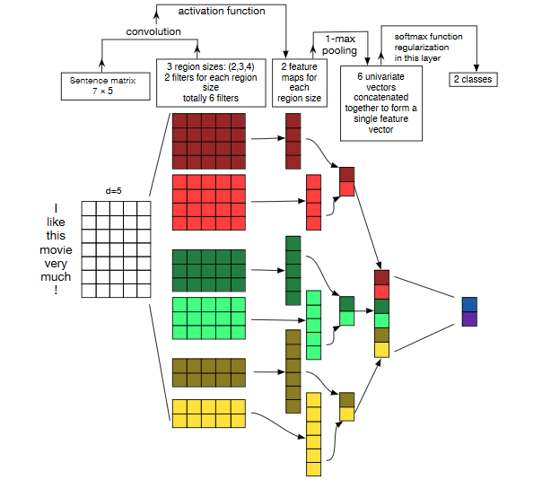
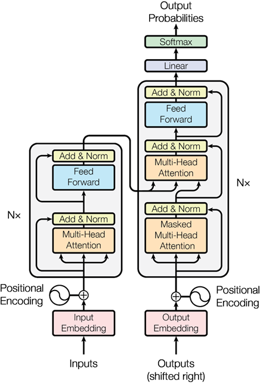
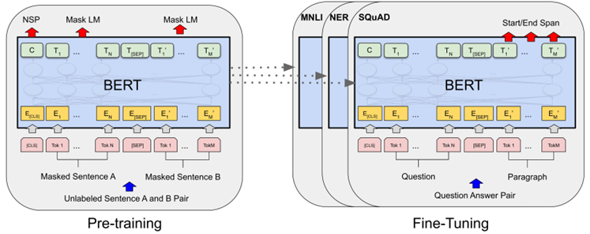

# imdb_sentiment_analysis_torch
本项目基于Kaggle的IMDB电影评论数据集，开展情感二分类任务的系统性研究。该数据集包含50,000条带有正负情感标签的英文影评，核心任务是从多样化的文本表达中准确识别情感倾向。  

在技术方法上，构建了从基础到前沿的完整技术路线。首先采用Word2Vec词嵌入方法将文本转化为语义向量，并在此基础上实现了CNN、LSTM、GRU和Transformer等深度学习模型。CNN专注于提取局部短语特征，LSTM/GRU通过门控机制建模序列依赖，Transformer则利用自注意力机制捕捉全局语义关系。

项目重点探索了预训练语言模型的应用，包括BERT、RoBERTa和DeBERTa等。这些模型基于“预训练-微调”范式，首先通过掩码语言建模等任务学习通用语言表示，再针对情感分类任务进行有监督微调，显著提升了模型性能。

为优化训练效率，采用了参数高效微调技术。LoRA方法通过在注意力模块注入低秩适配器，仅训练少量参数即可实现性能逼近全参数微调；同时尝试了P-Tuning和Prompt Tuning等提示微调方法。此外，我们还实践了R-Drop和监督对比学习等高级训练策略，通过增强模型的一致性和特征区分度来提升泛化能力。


## 一.数据集简介

### 1.概述
IMDB 数据集是自然语言处理领域中情感分析任务最经典和广泛使用的基准数据集之一，由斯坦福大学研究人员整理发布,该数据集因其规模适中、质量优良、任务明确，已成为情感分析研究的事实标准

### 2.数据规模与平衡性
- **总数据量**: 50,000 条电影评论
- **训练集**: 25,000 条
- **测试集**: 25,000 条  
- **标签分布**: 正面评价和负面评价各占50%，完美平衡

### 3.数据预处理
- 经过严格清洗，确保仅包含纯文本内容
- 移除HTML标签、特殊字符等噪声数据
- 保留原始文本的语言风格和情感表达

### 4.文本长度特征
- **平均长度**: 约235个单词
- **长度分布**: 从简短评语到长篇影评，跨度较大
- **词汇量**: 包含超过80,000个独特单词

### 5.语言特点
- 包含丰富的口语化表达和情感词汇
- 涉及多样的电影类型和评论视角
- 包含讽刺、夸张等复杂的语言现象


### 6.核心任务
**二分类情感分析**: 根据评论文本自动判断情感倾向
- **正面评价 (Positive)**: 标签为 1
- **负面评价 (Negative)**: 标签为 0

### 7.技术挑战

#### 语言复杂性
- 需要处理否定、转折等复杂语言结构
- 识别讽刺和隐含情感表达
- 理解电影领域的特定术语和背景知识

#### 模型要求
- 需要具备较强的语义理解能力
- 能够处理长文本序列
- 对上下文信息敏感


## 二.各类模型结果

## 1.基础神经网络模型
### 1.1 卷积神经网络（CNN）
核心思想：将计算机视觉中成功的卷积操作应用于文本序列，通过滑动窗口捕捉局部相关性。

模型原理：

使用不同尺寸的卷积核（如2,3,4个词）在文本序列上滑动

每个卷积核提取特定长度的短语特征

通过最大池化层保留最显著的特征

全连接层完成最终分类



输入文本 → 词嵌入层 → 多尺寸卷积核 → 最大池化 → 全连接层 → 输出分类

### 1.2 长短期记忆网络（LSTM）
核心思想：通过精密的门控机制解决传统RNN的梯度消失问题，有效捕捉长距离依赖。

门控机制：

遗忘门：决定从细胞状态中丢弃哪些信息

输入门：确定哪些新信息存储在细胞状态中

输出门：基于细胞状态决定输出什么信息


### 1.3 门控循环单元（GRU）
核心思想：LSTM的简化版本，将遗忘门和输入门合并为更新门，减少参数数量。

简化结构：

更新门：平衡历史信息与新输入的重要性

重置门：决定如何将新输入与过去记忆结合

原代码学习率太高导致准确率极低
```
lr = 0.8
```
将学习率降低至0.1，准确率显著提升

### 1.4 Transformer
核心思想：完全基于自注意力机制，摒弃循环结构，实现并行化计算和全局依赖捕捉。



核心组件：
自注意力机制：

```
Query、Key、Value向量计算：
Attention(Q,K,V) = softmax(QKᵀ/√dₖ)V
```

多头注意力：

```
多个注意力头并行工作，捕捉不同类型的依赖关系
头₁ → 捕捉语法依赖
头₂ → 捕捉情感表达
头₃ → 捕捉实体关系
```

Transformer编码器结构：
```
输入 → 词嵌入 + 位置编码 → [多头自注意力 → 前馈网络] × N → 输出表示
```

#### 代码修改
1. 嵌入维度与 Transformer 维度不匹配
```
embed_size = 300
num_hiddens = 120  # <-- 问题所在
num_layers = 2
```
修改后：
```
embed_size = 300
num_hiddens = 300  # <-- 必须与 embed_size 匹配
num_layers = 2
```
2. 验证循环中 forward 缺少参数
```
val_score = net(val_feature)
```
修改后：
```
val_score = net(val_feature, val_length)
```

## 各模型准确率
| 模型 | 准确率 |
|---|---|
| cnn | 0.85 |
| cnnlstm | 0.93 |
| attention_lstm | 0.91 |
| capsule_lstm | 0.90 |
| gru | 0.87 |
| lstm | 0.83 |
| Transformer| 0.67  |


## 2. 预训练模型微调


### 2.1 BERT-native

BERT-native 是指使用原始BERT架构及其预训练权重，直接在目标任务上进行基础微调的模型。它基于Transformer编码器构建，采用了掩码语言建模和下一句预测的双重预训练任务，能够有效捕捉文本的深层语义表示。在IMDB情感分析任务中，该模型作为基准参考，展现了预训练模型相比传统神经网络的优势。

### 2.2 DistilBERT-native

DistilBERT-native 是基于知识蒸馏技术得到的轻量化BERT模型。它通过在训练过程中让小型学生模型模仿大型教师模型的行为，实现了模型体积减小40%、推理速度提升60%，同时保留了97%的原始性能。这个版本使用基础微调策略，在保持较好准确率的同时显著提升了计算效率，适合资源受限的应用场景。

### 2.3 DistilBERT-trainer

DistilBERT-trainer 在轻量化的DistilBERT基础上采用了优化的微调策略。通过使用Hugging Face Trainer类及其内置的最佳实践，包括动态学习率调整、梯度累积和精细的超参数调优，该模型能够充分挖掘轻量架构的潜力。在项目中，该版本相比基础微调版本展现了更好的性能表现。

### 2.4 BERT-scratch

BERT-scratch 是使用BERT架构但舍弃预训练权重的特殊版本。该模型的权重完全随机初始化，仅在IMDB数据集上从头开始训练。这种方法主要用于验证预训练阶段的重要性，实验结果显示其性能明显低于基于预训练的版本，证实了预训练语言模型通过海量无标注数据学习到的语言先验知识具有重要价值。

### 2.5 BERT-trainer

BERT-trainer 代表采用先进微调技术的原始BERT模型。该版本不仅使用预训练权重，还通过系统化的训练优化策略来充分释放模型潜力。包括学习率调度、权重衰减、梯度裁剪等技术在内的完整训练流程，使得模型能够更好地适应下游任务，在情感分析任务中取得了显著优于基础微调版本的效果。

### 2.6 RoBERTa-trainer

RoBERTa-trainer 是基于RoBERTa模型的优化微调版本。RoBERTa作为BERT的改进版本，移除了下一句预测任务，采用动态掩码机制，使用更大的批次规模和更多的训练数据，在预训练阶段学习到了更强大的语言表示能力。结合先进的微调策略后，该模型在IMDB情感分析任务中取得了最佳性能，展现了预训练方法和微调技术的双重进步。


### 各模型总结对比
| 模型名称             | 核心特点                     | 优势                           |
|----------------------|------------------------------|--------------------------------|
| **BERT-native**      | 原始BERT，基础微调           | 基线模型，实现简单             |
| **BERT-scratch**     | 无预训练，从头学习           | 用于研究预训练的价值           |
| **BERT-trainer**     | 原始BERT，优化微调           | 充分发挥BERT潜力               |
| **DistilBERT-native**| 轻量BERT，基础微调           | 速度快，体积小                 |
| **DistilBERT-trainer**| 轻量BERT，优化微调          | 效率与效果的平衡               |
| **RoBERTa-trainer**  | 强化BERT，优化微调           | 预训练更充分，性能最强         |

## 各模型准确率
| 模型        | 准确率    |
|------------------|-----------|
| BERT-native      |  0.94 |
| DistilBERT-native|  0.92  |
| DistilBERT-trainer|  0.92 |
| BERT-scratch     | 0.93  |
| BERT-trainer     | 0.94 |
| RoBERTa-trainer  | 0.93  |


## 3. 参数高效微调（PEFT）


### 3.1 LoRA (Low-Rank Adaptation)

**核心思想**：在模型的注意力权重矩阵旁注入可训练的"低秩适配器"，而非微调原始权重。

**工作原理**：假设预训练模型的权重矩阵 $W$ 在适应下游任务时的变化 $\Delta W$ 是低秩的。LoRA将其分解为 $\Delta W = BA$，其中 $B$ 和 $A$ 是两个小的低秩矩阵，仅训练这两个矩阵。

**优势**：
- 极高的参数效率：仅需训练原模型参数量的0.01%~1%
- 无推理延迟：训练完成后，可以将 $\Delta W$ 合并回原权重 $W$，模型结构不变，推理速度不变
- 灵活性：可以灵活地指定目标模块（如Query、Value投影层）

**适用场景**：最通用和流行的PEFT方法，适用于大多数下游任务。

### 3.2 P-Tuning

**核心思想**：在输入序列中引入可训练的连续型"软提示"，让模型通过这些提示来理解任务。

**工作原理**：在输入文本的嵌入向量前，插入一组由模型学习的、可优化的连续向量（即软提示）。这些提示作为任务的"引导信息"，与原始输入一起送入模型的每一层。

**优势**：
- 不改变模型架构：只在输入层面进行操作
- 比离散提示更有效：相比人工设计的文本提示，可学习的连续提示性能通常更好

**适用场景**：特别适合提示学习和知识挖掘任务。

### 3.3 Prefix Tuning (前缀微调)

**核心思想**：在模型的每一层的输入序列前，都添加一组可训练的连续向量（称为前缀）。

**工作原理**：可以看作是P-Tuning的深化。它不是简单地在输入嵌入层加提示，而是在Transformer的每一层（在注意力模块的Key和Value中）都添加一组可训练的前缀向量，从而更深层次地引导模型的激活值。

**优势**：
- 对模型行为控制力更强：由于作用于每一层，能更有效地引导模型的表示学习

**适用场景**：生成式任务（如文本摘要、对话生成）上表现优异。

### 3.4 Prompt Tuning

**核心思想**：P-Tuning的简化版，仅在输入嵌入层添加可训练的软提示。

**工作原理**：只在最开始的输入嵌入层添加一组可学习的提示向量，后面的模型层保持不变。可以看作是Prefix Tuning的轻量级版本。

**优势**：
- 最简单、参数最少：在所有PEFT方法中，它需要训练的参数量通常是最少的
- 部署简便

**适用场景**：当模型参数量非常大时（例如百亿以上），Prompt Tuning的效果会接近其他方法，是极致效率追求下的选择。


### 各方法总结对比
| 特性 | LoRA | P-Tuning | Prefix Tuning | Prompt Tuning |
|---|---|---|---|---|
| **核心思想** | 在权重旁加低秩适配器 | 在输入加可训练软提示 | 在每一层前加可训练前缀 | 仅在输入层加可训练软提示 |
| **作用位置** | 注意力权重矩阵 | 输入嵌入层 | 所有Transformer层 | 输入嵌入层 |
| **参数量** | 较少 | 很少 | 中等 | 极少 |
| **效果** | 通常最好、最稳定 | 较好 | 较好 | 模型越大效果越好 |
| **通用性** | 非常高 | 高 | 较高 | 较高 |

该部分由于模型太大，出现OutOfMemory的情况，对此，采用量化，同时max_length=256
prefix部分代码会与原有模型产生冲突，因此更换模型。
同时该部分代码需要适当降低学习率以提高准确率


## 各模型准确率
| 模型         | 准确率   |
|--------------|----------|
| LoRA-int8    | 0.85  |
| Ptuning-int8 | 0.81  |
| Prompt       | 0.80  |
| prefix    | 0.77  |


## 4. 高级训练策略
### 3.1 Unsloth 优化框架实践
Unsloth 是一个专为高效微调大型语言模型（LLMs）而设计的开源优化框架，其核心目标是显著提升训练速度并降低显存消耗，同时不牺牲模型的性能。

核心特性与工作原理：

1.手动融合内核

问题：标准的 PyTorch 操作（如矩阵乘法、LayerNorm、SiLU 激活函数等）会启动多个独立的内核，导致大量的内存读写开销和内核启动开销。

Unsloth 的解决方案：它将多个连续的操作（如：Q * K^T + 掩码 -> Softmax -> 注意力权重 * V）融合成一个单一的、高度优化的 CUDA 内核。这极大地减少了 GPU 内存的读写次数和内核启动次数，从而成为速度提升的关键。

2.更快的自动微分

Unsloth 重写了反向传播过程，针对其融合后的前向传播内核，实现了更高效、更快速的梯度计算。

3.内存优化

通过一系列技术（如智能梯度检查点、高效的内存管理）来降低训练过程中的峰值显存占用，使得在消费级显卡（如 RTX 3090/4090）上微调大模型成为可能。

4.与 PEFT 的无缝集成

Unsloth 原生支持 LoRA、QLoRA 等参数高效微调方法，并与 Hugging Face Transformers 库完全兼容，用户只需修改几行代码即可享受到优化

~~~
 model = FastModel.get_peft_model(
        model,
        r=16,  # Choose any number > 0 ! Suggested 8, 16, 32, 64, 128
        # target_modules=[
        #     "q_proj", "k_proj", "v_proj", "o_proj",
        #     "gate_proj", "up_proj", "down_proj", ],
        lora_alpha=32,
        lora_dropout=0,  # Supports any, but = 0 is optimized
        bias="none",  # Supports any, but = "none" is optimized
        # [NEW] "unsloth" uses 30% less VRAM, fits 2x larger batch sizes!
        use_gradient_checkpointing="unsloth",  # True or "unsloth" for very long context
        random_state=3407,
        use_rslora=False,  # We support rank stabilized LoRA
        loftq_config=None,  # And LoftQ
        task_type="SEQ_CLS",
    )
~~~


### 3.2. R-Drop 正则化技术

**R-Drop** 是一种通过**约束模型随机性**来提升泛化能力的正则化技术。其核心思想是：对于相同的输入，模型在不同 Dropout 掩码下的输出应该是一致的。

**核心思想：**
*   Dropout 在训练时随机关闭一部分神经元，导致同一个输入在两次前向传播中会经过略有不同的子网络，从而产生两个不同的输出分布。
*   R-Drop 认为，一个鲁棒的模型对于同一个输入，无论经过哪个随机的子网络，其预测结果都应该是一致的。

**工作原理与实现：**
1.  **两次前向传播**：对于同一个训练样本，在一个训练步内进行两次前向传播，每次使用不同的 Dropout 掩码。这会得到两个预测输出分布 \(P_1\) 和 \(P_2\)。
2.  **构建损失函数**：总损失由三部分组成：
    *   **任务损失1**：计算 \(P_1\) 与真实标签的交叉熵损失 \(L_{CE}^{1}\)。
    *   **任务损失2**：计算 \(P_2\) 与真实标签的交叉熵损失 \(L_{CE}^{2}\)。
    *   **一致性损失**：计算 \(P_1\) 和 \(P_2\) 之间的双向 KL 散度，以约束它们的一致性。
        \(L_{KL} = \frac{1}{2} [KL(P_1 || P_2) + KL(P_2 || P_1)]\)
3.  **总损失**：\(L_{total} = L_{CE}^{1} + L_{CE}^{2} + \alpha * L_{KL}\)
    其中，\(\alpha\) 是一个超参数，用于控制一致性损失的权重。

**优势：**
*   **提升泛化能力**：通过一致性约束，迫使模型学习更本质、更鲁棒的特征，减少对特定神经元路径的依赖，有效防止过拟合。
*   **即插即用**：实现简单，只需在训练循环中增加一次前向传播和 KL 散度计算，无需修改模型结构。
*   **通用性强**：可广泛应用于分类、生成等多种任务。

[参考论文](https://arxiv.org/abs/2106.14448) 


继承Huggingface的BertPreTrainedModel重写forward方法：
~~~
class BertScratch(BertPreTrainedModel):
    def __init__(self, config):
        super().__init__(config)
        self.num_labels = config.num_labels
        self.config = config

        self.bert = BertModel(config)
        classifier_dropout = (
            config.classifier_dropout if config.classifier_dropout is not None else config.hidden_dropout_prob
        )
        self.dropout = nn.Dropout(classifier_dropout)
        self.classifier = nn.Linear(config.hidden_size, config.num_labels)

        self.post_init()

    # === 修改点：增加了 **kwargs 以接收 inputs_embeds 等额外参数 ===
    def forward(self, input_ids=None, attention_mask=None, token_type_ids=None, labels=None, **kwargs):
        # 第一次前向传播
        outputs = self.bert(input_ids, attention_mask, token_type_ids)
        pooled_output = outputs[1]
        pooled_output = self.dropout(pooled_output)
        logits = self.classifier(pooled_output)

        loss = None
        if labels is not None:
            loss_fct = nn.CrossEntropyLoss()
            loss = loss_fct(logits.view(-1, self.num_labels), labels.view(-1))

            # === R-Drop 逻辑 ===
            if self.training:
                kl_outputs = self.bert(input_ids, attention_mask, token_type_ids)
                kl_output = kl_outputs[1]
                kl_output = self.dropout(kl_output)
                kl_logits = self.classifier(kl_output)

                ce_loss = loss_fct(kl_logits.view(-1, self.num_labels), labels.view(-1))
                
                alpha = 1.0 
                kl_loss = (KL(logits, kl_logits, "sum") + KL(kl_logits, logits, "sum")) / 2.
                
                total_loss = loss + ce_loss + alpha * kl_loss
                loss = total_loss

        return SequenceClassifierOutput(
            loss=loss,
            logits=logits,
            hidden_states=outputs.hidden_states,
            attentions=outputs.attentions
        )
~~~

配置并挂载 LoRA
~~~
peft_config = LoraConfig(
        task_type=TaskType.SEQ_CLS, 
        inference_mode=False, 
        r=8,             
        lora_alpha=32,   
        lora_dropout=0.1,
        target_modules=["query", "value"] 
    )
    
    model = get_peft_model(model, peft_config)
    model.print_trainable_parameters()

    metric = evaluate.load("accuracy")

    def compute_metrics(eval_pred):
        logits, labels = eval_pred
        predictions = np.argmax(logits, axis=-1)
        return metric.compute(predictions=predictions, references=labels)

    training_args = TrainingArguments(
        output_dir='./checkpoint_lora',
        num_train_epochs=3,
        per_device_train_batch_size=16,
        per_device_eval_batch_size=16,
        warmup_steps=500,
        learning_rate=2e-4, 
        weight_decay=0.01,
        logging_dir='./logs',
        logging_steps=100,
        report_to="none",
        save_strategy="no",
        eval_strategy="epoch",
        remove_unused_columns=False,
        label_names=["labels"] # 显式指定 label_names 消除警告
    )

    trainer = Trainer(
        model=model,
        args=training_args,
        train_dataset=tokenized_train,
        eval_dataset=tokenized_val,
        tokenizer=tokenizer,
        data_collator=data_collator,
        compute_metrics=compute_metrics,
    )

    trainer.train()
~~~


---

### 3.3 监督对比学习

对比学习的核心思想是：在表示空间中，**拉近正样本对的距离，推远负样本对的距离**。监督对比学习将这一思想与标签信息相结合。

**核心思想：**
*   **无监督对比学习**：正样本通常是同一数据的不同增强视图（如，同一张图片的两次随机裁剪），负样本是批次中的其他所有样本。
*   **监督对比学习**：利用真实的标签信息来定义正负样本。**同一个类别的样本互为正样本，不同类别的样本互为负样本。**

**工作原理与实现：**
1.  **构建批次**：在一个训练批次中，包含多个类别，每个类别有多个样本。
2.  **特征提取**：将样本输入模型，得到其归一化后的特征向量 \(z_i\)。
3.  **计算损失**：对于每个样本（锚点）：
    *   **正样本**：批次中所有与锚点同类别的其他样本。
    *   **负样本**：批次中所有与锚点不同类别的样本。
    *   监督对比损失鼓励锚点与所有正样本的相似度远高于与所有负样本的相似度。

**损失函数：**
\[
\mathcal{L}_{supcon} = \sum_{i=1}^{N} \frac{-1}{|P(i)|} \sum_{p \in P(i)} \log \frac{\exp(z_i \cdot z_p / \tau)}{\sum_{a \in A(i)} \exp(z_i \cdot z_a / \tau)}
\]
*   \(P(i)\)：是锚点 \(i\) 的所有正样本的集合。
*   \(A(i)\)：是锚点 \(i\) 之外的所有样本的集合。
*   \(\tau\)：是温度参数，用于调节分布的尖锐程度。
*   \( |P(i)| \) 用于归一化，确保每个锚点的损失不会被其正样本数量所主导。

**优势：**
*   **学习更好的特征表示**：它能够学习到**类内紧凑、类间分离**的特征空间，即同一类的样本特征聚集在一起，不同类的样本特征彼此远离。
*   **增强模型判别能力**：这种特征结构使得决策边界更加清晰，提高了模型的分类性能和对噪声的鲁棒性。
*   **与交叉熵损失互补**：监督对比学习侧重于样本间的相对关系，而交叉熵损失侧重于绝对分类。在实践中，常将两种损失结合使用，如您的项目中所做：\(L_{total} = L_{CE} + \beta * L_{SupCon}\)。
[参考论文](https://arxiv.org/abs/2004.11362)

继承Huggingface的BertPreTrainedModel重写forward方法：
~~~
class BertScratch(BertPreTrainedModel):
    def __init__(self, config):
        super().__init__(config)
        self.num_labels = config.num_labels
        self.config = config
        self.alpha = 0.1 # 稍微降低 SCL Loss 权重，避免主导

        self.bert = BertModel(config)
        classifier_dropout = (
            config.classifier_dropout if config.classifier_dropout is not None else config.hidden_dropout_prob
        )
        self.dropout = nn.Dropout(classifier_dropout)
        self.classifier = nn.Linear(config.hidden_size, config.num_labels)
        
        self.scl_fct = SupConLoss(temperature=0.07) 
        self.post_init()

    def forward(self, input_ids=None, attention_mask=None, token_type_ids=None, labels=None, **kwargs):
        outputs = self.bert(input_ids, attention_mask, token_type_ids)
        pooled_output = outputs[1]
        pooled_output = self.dropout(pooled_output)
        logits = self.classifier(pooled_output)

        loss = None
        if labels is not None:
            loss_fct = nn.CrossEntropyLoss()
            ce_loss = loss_fct(logits.view(-1, self.num_labels), labels.view(-1))
            
            if self.training:
                # === 关键修复: 对特征进行 L2 归一化 ===
                # 对比学习必须使用归一化的向量，否则点积会爆炸导致 Loss NaN
                normed_features = F.normalize(pooled_output, dim=1).unsqueeze(1)
                
                scl_loss = self.scl_fct(normed_features, labels)
                loss = ce_loss + self.alpha * scl_loss
            else:
                loss = ce_loss

        return SequenceClassifierOutput(
            loss=loss,
            logits=logits,
            hidden_states=outputs.hidden_states,
            attentions=outputs.attentions
        )
~~~


损失函数：
~~~
class SupConLoss(nn.Module):
    def __init__(self, temperature=0.07, contrast_mode='all', base_temperature=0.07):
        super(SupConLoss, self).__init__()
        self.temperature = temperature
        self.contrast_mode = contrast_mode
        self.base_temperature = base_temperature

    def forward(self, features, labels=None, mask=None):
        device = (torch.device('cuda') if features.is_cuda else torch.device('cpu'))

        if len(features.shape) < 3:
            raise ValueError('`features` needs to be [bsz, n_views, ...], at least 3 dimensions are required')
        if len(features.shape) > 3:
            features = features.view(features.shape[0], features.shape[1], -1)

        batch_size = features.shape[0]
        if labels is not None and mask is not None:
            raise ValueError('Cannot define both `labels` and `mask`')
        elif labels is None and mask is None:
            mask = torch.eye(batch_size, dtype=torch.float32).to(device)
        elif labels is not None:
            labels = labels.contiguous().view(-1, 1)
            if labels.shape[0] != batch_size:
                raise ValueError('Num of labels does not match num of features')
            mask = torch.eq(labels, labels.T).float().to(device)
        else:
            mask = mask.float().to(device)

        contrast_count = features.shape[1]
        contrast_feature = torch.cat(torch.unbind(features, dim=1), dim=0)
        if self.contrast_mode == 'one':
            anchor_feature = features[:, 0]
            anchor_count = 1
        elif self.contrast_mode == 'all':
            anchor_feature = contrast_feature
            anchor_count = contrast_count
        else:
            raise ValueError('Unknown mode: {}'.format(self.contrast_mode))

        # Compute logits
        anchor_dot_contrast = torch.div(torch.matmul(anchor_feature, contrast_feature.T), self.temperature)
        
        # Numerical stability check
        logits_max, _ = torch.max(anchor_dot_contrast, dim=1, keepdim=True)
        logits = anchor_dot_contrast - logits_max.detach()

        # Tile mask
        mask = mask.repeat(anchor_count, contrast_count)
        
        # Mask-out self-contrast cases
        logits_mask = torch.scatter(
            torch.ones_like(mask), 1,
            torch.arange(batch_size * anchor_count).view(-1, 1).to(device), 0
        )
        mask = mask * logits_mask

        # Compute log_prob
        exp_logits = torch.exp(logits) * logits_mask
        log_prob = logits - torch.log(exp_logits.sum(1, keepdim=True) + 1e-8) # Add epsilon

        # Compute mean of log-likelihood over positive
        # === 关键修复: 分母加 1e-8 防止除以 0 (当 Batch 内只有自身一个类别时) ===
        mask_pos_pairs = mask.sum(1)
        mask_pos_pairs = torch.where(mask_pos_pairs < 1e-6, torch.ones_like(mask_pos_pairs), mask_pos_pairs)
        mean_log_prob_pos = (mask * log_prob).sum(1) / mask_pos_pairs

        # Loss
        loss = - (self.temperature / self.base_temperature) * mean_log_prob_pos
        loss = loss.view(anchor_count, batch_size).mean()
        return loss
~~~


### 总结对比

| 技术 | 核心目标 | 核心思想 | 优势 |
| :--- | :--- | :--- | :--- |
| **Unsloth** | **提升训练效率** | 通过内核融合、内存优化等手段，加速训练并降低显存消耗。 | 训练速度显著提升，硬件门槛降低，易于使用。 |
| **R-Drop** | **提升模型鲁棒性** | 强制模型对不同Dropout子网络下的同一输入产生一致输出。 | 有效防止过拟合，提升泛化能力，即插即用。 |
| **监督对比学习** | **学习优质特征表示** | 利用标签信息，在特征空间拉近同类样本、推远异类样本。 | 特征更具判别性，决策边界更清晰，模型更鲁棒。 |


## 各模型准确率
| 模型         | 准确率   |
|--------------|----------|
| deberta_unsloth    | 0.95068 |
|ModernBERT_unsloth | 0.95860  |
| bert_scratch_lora      | 0.92396 |
| bert_scl_lora    | 0.92092  |
